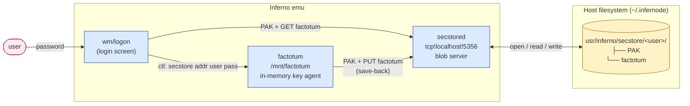
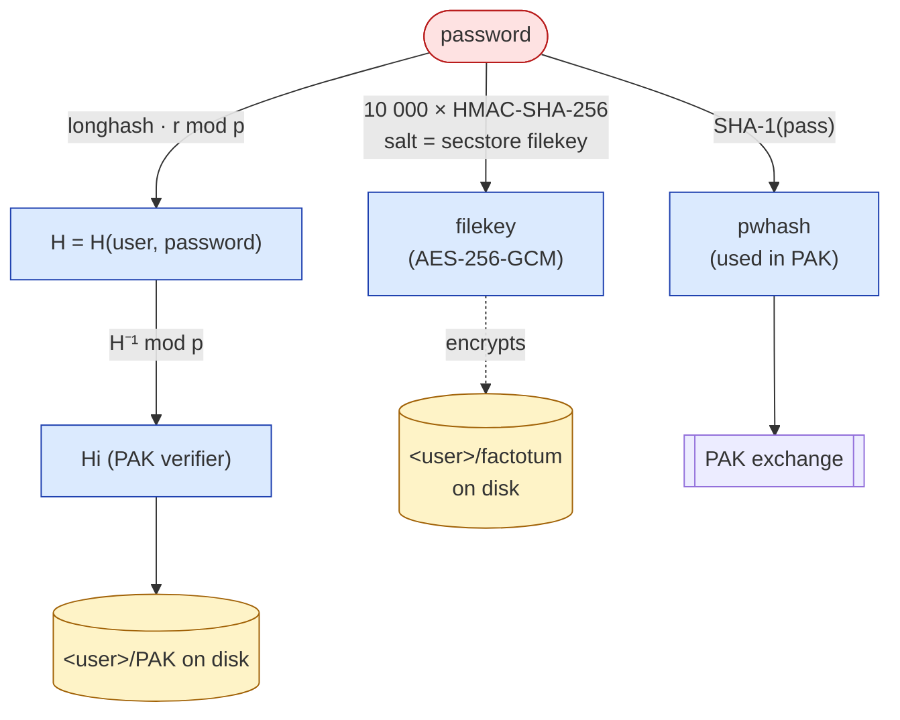
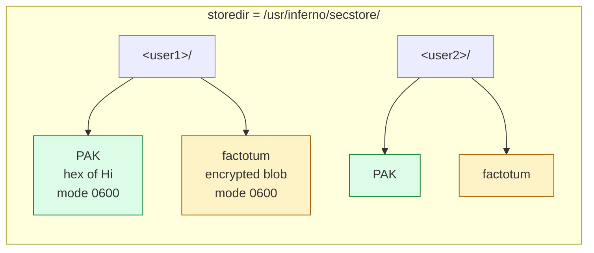
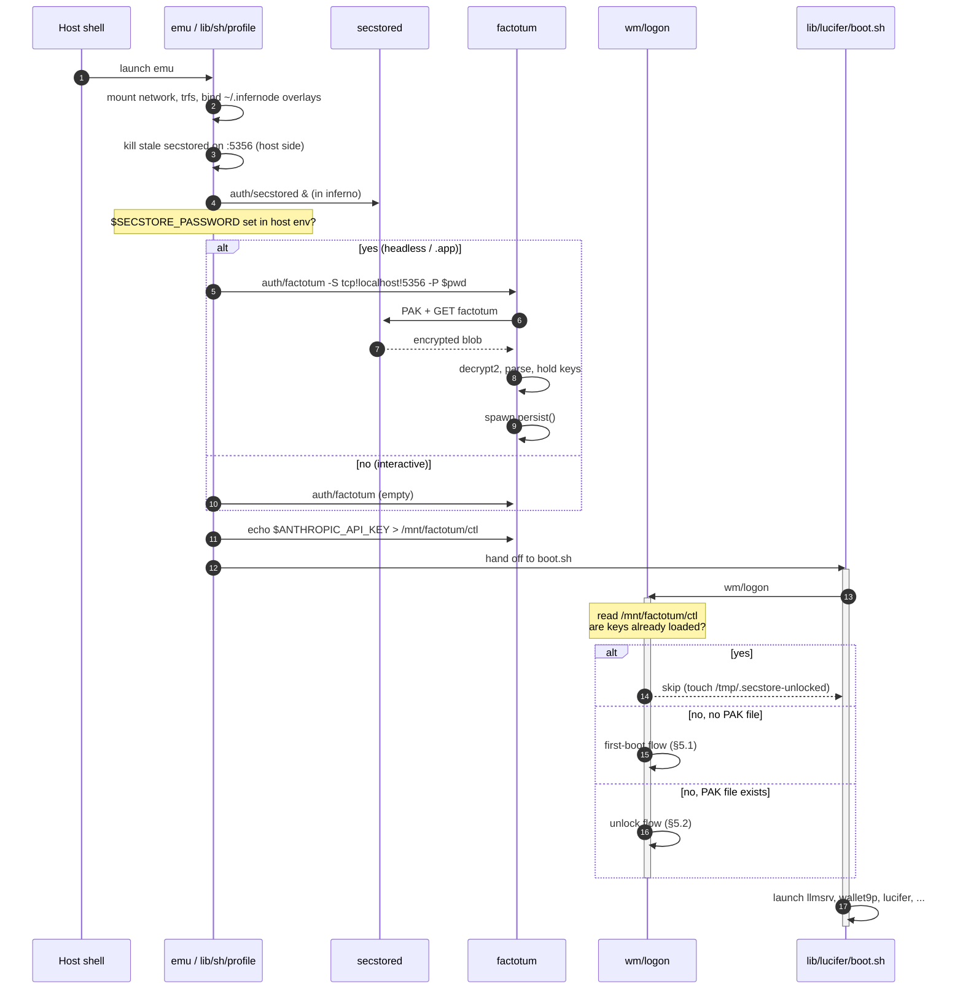
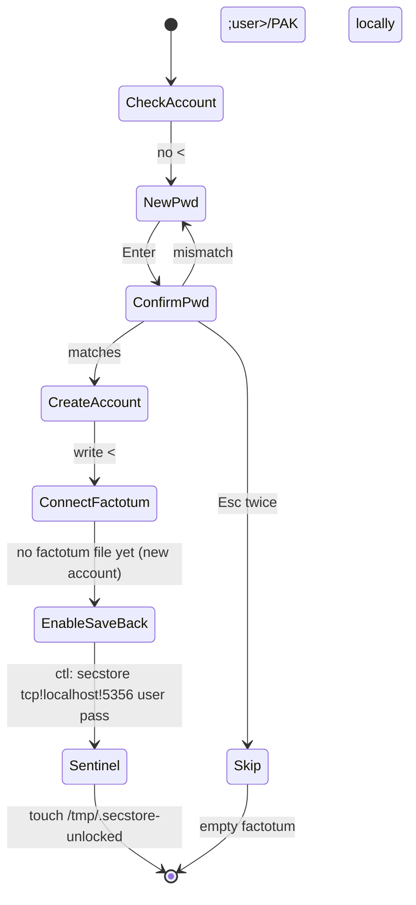
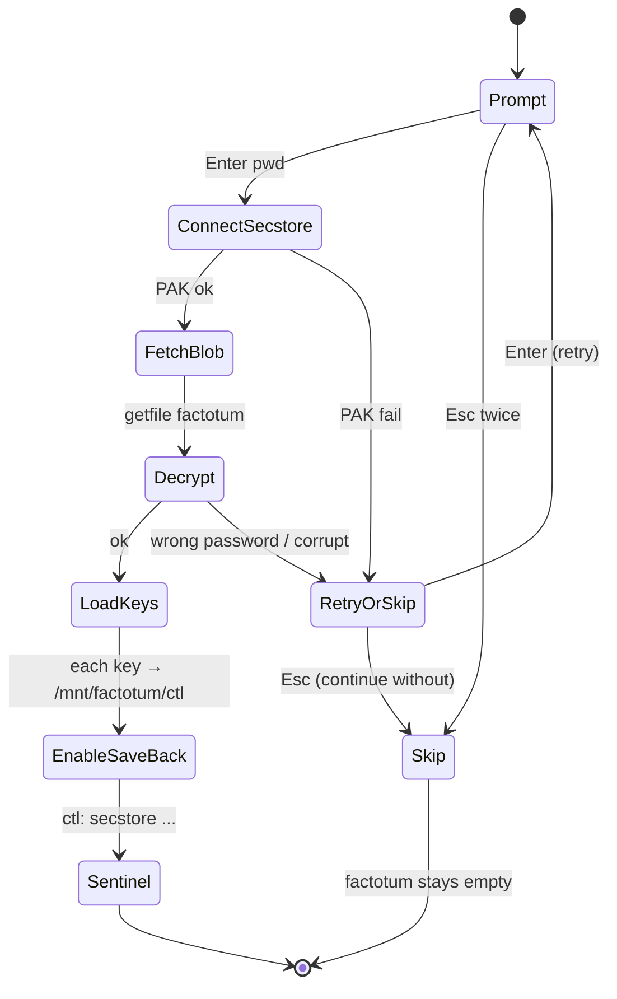
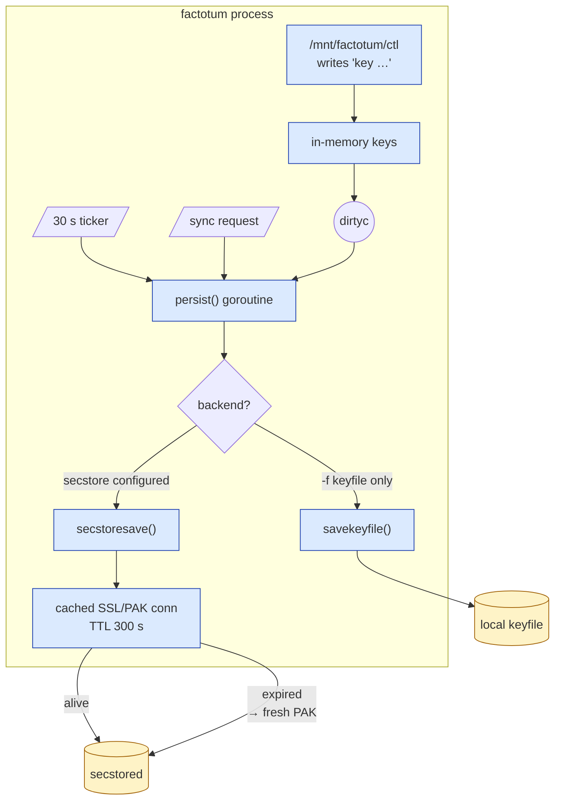
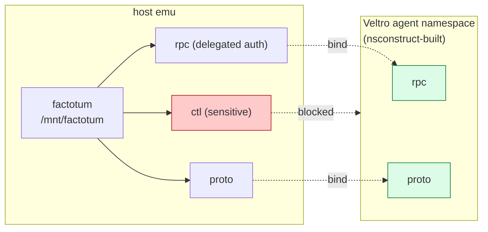
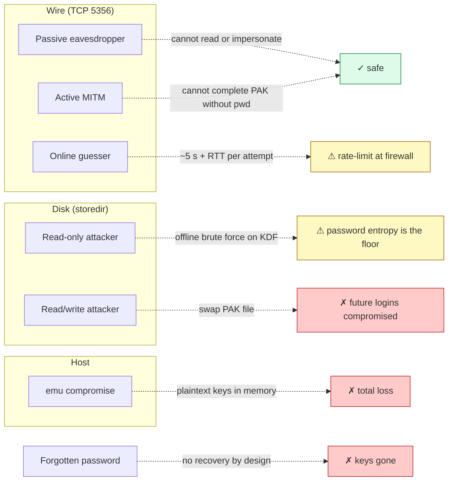

# Authentication

> **Scope.** This document is the canonical reference for InferNode's authentication
> stack: secstore (the encrypted key-persistence service), factotum (the in-memory
> key agent), `wm/logon` (the login screen), and the PAK protocol that ties them
> together. Topology variants (single host, dedicated server, peer-to-peer) live
> in the companion document, [DISTRIBUTED-AUTH.md](DISTRIBUTED-AUTH.md).
>
> **Audience.** Operators who need to reason about what is encrypted by what,
> what an attacker on the wire can or cannot do, and how to deploy the stack
> beyond a single host.

## 1. Components at a glance



| Component   | Source                              | Role                                                                       |
|-------------|-------------------------------------|----------------------------------------------------------------------------|
| `secstored` | `appl/cmd/auth/secstored.b`         | TCP server. PAK auth, opaque blob store. Knows nothing about file content. |
| `secstore`  | `appl/lib/secstore.b`               | Client library. PAK client, AES-GCM/CBC encrypt/decrypt.                   |
| `factotum`  | `appl/cmd/auth/factotum/factotum.b` | In-memory key agent at `/mnt/factotum`. Save-back to secstore.             |
| `wm/logon`  | `appl/wm/logon.b`                   | Fullscreen login screen. Unlocks secstore, pushes keys into factotum.      |
| `auth/secstore`       | `appl/cmd/auth/secstore.b`        | CLI: list/get/put/rm files manually.                              |
| `auth/secstore-setup` | `appl/cmd/auth/secstore-setup.b`  | Create a new account (writes `<user>/PAK` to the store directory). |

## 2. Threat model — quick version

The full table is in §8. Up front:

- **Trusted:** the host kernel, anything with read access to the storedir on disk
  (it is the system of record), and the user's password.
- **Untrusted:** the network between client and server, any process that can
  reach `tcp!host!5356` over the wire.
- **Confidentiality is provided by client-side encryption,** not by the wire.
  An attacker who reads the storedir gets only the encrypted `factotum` blob and
  the PAK verifier `Hi`; both are useless without the password.
- **There is no PKI, no certificate, no host identity** in the secstore protocol
  itself. The SSL session keys are derived entirely from the PAK exchange. Server
  identity is bound only by the server-name string `S=` exchanged inside PAK
  and the PAK shared secret — i.e. by mutual knowledge of the verifier `Hi`.
- **There is no password recovery.** The PAK verifier is one-way; the file key
  derives from the password. Lose the password, lose the keys.



The diagram says: **the password is the root of every secret**. There is no
escrow, no recovery key, no backup factor.

## 3. The PAK exchange

PAK (Password Authenticated Key exchange) is a Diffie–Hellman variant in which
both endpoints authenticate by demonstrating knowledge of a per-user value
`Hi = H(user, password)⁻¹ mod p`. The server stores `Hi` (the *verifier*); the
client recomputes it from the password every time. A passive eavesdropper learns
nothing useful, and an active attacker without the password cannot impersonate
either side.

### 3.1 Parameters

| Parameter | Source                          | Notes                                              |
|-----------|---------------------------------|----------------------------------------------------|
| `p`       | 1024-bit prime, fixed in code   | `appl/lib/secstore.b:initPAKparams` and mirrored in `secstored.b` and `factotum.b`. |
| `q`       | 160-bit prime, `q | (p−1)`      | Subgroup order.                                    |
| `g`       | Generator of order `q`          |                                                    |
| `r`       | Used to stretch the password    | `H = h(...)^r mod p` is the slow step.             |
| Hash      | SHA-1                           | Used in `longhash` and `shorthash`.                |
| KDF       | Iterated `h^r mod p`            | ~5 s on a laptop; cached per (user, pwhash).       |

The same `(p, q, r, g)` are hard-coded in **client** (`secstore.b`), **server**
(`secstored.b`), and **factotum** (`factotum.b:secstoresetup`). All three must
agree, and they do; do not edit one without the others.

### 3.2 Wire transcript

```mermaid
sequenceDiagram
    autonumber
    participant C as Client (secstore.b)
    participant S as Server (secstored.b)
    participant D as Storedir on disk

    Note over C,S: TCP + Inferno SSL channel established<br/>(no keys yet — channel exists, payload still cleartext)
    C->>S: TCP connect tcp!host!5356
    S-->>C: ssl->connect on accept

    Note over C: Compute H = (longhash)^r mod p   (~5 s, cached)<br/>Compute Hi = H⁻¹ mod p<br/>Pick x ∈ [1, q)<br/>Compute m = (g^x · H) mod p

    C->>S: secstore␉PAK\nC=&lt;user&gt;\nm=&lt;hexm&gt;\n
    S->>D: read &lt;user&gt;/PAK
    D-->>S: hexHi
    Note over S: Pick y ∈ [1, q)<br/>mu = g^y mod p<br/>sigma = (m · Hi)^y mod p<br/>ks = base64(SHA1("server", C, S, m, mu, sigma, Hi))
    S-->>C: mu=&lt;hexmu&gt;\nk=&lt;ks&gt;\nS=&lt;sname&gt;\n

    Note over C: sigma = mu^x mod p<br/>verify ks against own SHA1(...)
    alt server didn't know Hi
        C-->>S: abort (verifier mismatch)
    end

    Note over C: kc = base64(SHA1("client", C, S, m, mu, sigma, Hi))
    C->>S: k'=&lt;kc&gt;\n
    alt client didn't know password
        S-->>C: abort (verifier didn't match)
    end

    Note over C,S: digest = SHA1("session", C, S, m, mu, sigma, Hi)<br/>secret_out = HMAC-SHA1(digest, "one")<br/>secret_in  = HMAC-SHA1(digest, "two")<br/>(server uses opposite direction labels)
    C-)S: ssl->secret(in, out)
    S-)C: ssl->secret(in, out)
    C->>S: alg sha256 aes_128_cbc
    S->>C: alg sha256 aes_128_cbc
    S-->>C: OK

    Note over C,S: Channel is now mutually authenticated and encrypted.<br/>AES-128-CBC bulk, HMAC-SHA-256 integrity,<br/>keys derived from PAK shared secret.
```

A successful exchange establishes:

1. The server held `Hi` for `<user>`.
2. The client knew `password` such that `H(user, password)⁻¹ mod p = Hi`.
3. They agreed on a fresh shared secret `sigma = g^(xy) mod p`.

### 3.3 Account-existence probe (`cansecstore`)

A client may probe whether an account exists without attempting auth, by sending
`m=0`. The probe is unauthenticated.

This is inherited secstore protocol behavior, not an InferNode-specific
extension: upstream secstore exposes the same `cansecstore()` client API.
InferNode hardens deployment by defaulting the server to loopback, while
keeping the wire behavior compatible when an operator intentionally exposes
`secstored` with `-a`.

```mermaid
sequenceDiagram
    participant C as Client
    participant S as secstored

    C->>S: secstore␉PAK\nC=&lt;user&gt;\nm=0\n
    alt &lt;user&gt;/PAK exists
        S-->>C: !account exists
    else
        S-->>C: !no account
    end
```

Anyone reachable on TCP 5356 can enumerate which usernames exist. Treat user
names as semi-public.

Historically this sat behind Inferno/Plan 9's normal auth-service naming
convention rather than an internet-facing listener. Upstream clients default to
`net!$auth!secstore`, with `$auth` resolved by the system's name service
(`cs`/`ndb`) to the site's chosen authentication host. In that model, the
service is expected to live on a trusted site or VPN-like network, not on every
interface of a workstation by default.

## 4. File format on disk



### 4.1 The `factotum` blob

Plaintext is a newline-terminated list of `key <attrs>` lines, exactly as
factotum prints on `read /mnt/factotum/ctl`:

```
key proto=pass service=anthropic user=apikey !password=sk-...
key proto=pass service=ssh user=alice !password=...
key proto=pass service=wallet-eth-default user=alice !password=0x...
```

Two on-disk formats coexist (auto-detected on read by `secstore.b:decrypt2`):

```mermaid
flowchart TB
    blob[("&lt;user&gt;/factotum bytes")] --> magic{"first 6 bytes<br/>== SGCM1\n ?"}
    magic -- yes --> modern["Modern format (writes use this)"]
    magic -- no --> legacy["Legacy format (read-only fallback)"]

    subgraph modernfmt["Modern (AES-256-GCM)"]
        direction LR
        m1["SGCM1\n<br/>(6 B magic)"] --> m2["nonce<br/>(12 B)"] --> m3["ciphertext<br/>(N B)"] --> m4["GCM tag<br/>(16 B)"]
    end

    subgraph legacyfmt["Legacy (AES-128-CBC, no MAC)"]
        direction LR
        l1["IV<br/>(16 B)"] --> l2["ciphertext<br/>(N B, padded)"] --> l3["check pattern<br/>'XXXX...' (16 B)"]
    end

    modern -.--> modernfmt
    legacy -.--> legacyfmt

    classDef good fill:#dcfce7,stroke:#15803d
    classDef bad fill:#fecaca,stroke:#b91c1c
    class modernfmt good
    class legacyfmt bad
```

| Format          | Magic        | Cipher         | KDF                                                  | Integrity        |
|-----------------|--------------|----------------|------------------------------------------------------|------------------|
| **Modern**      | `SGCM1\n`    | AES-256-GCM    | 10 000 rounds HMAC-SHA-256, salt `"secstore filekey"`| GCM tag (16 B), AAD = magic |
| Legacy (read-only) | none      | AES-128-CBC    | `SHA1("aescbc file" ‖ password)` truncated to 16 B   | trailing constant `"XXXXXXXXXXXXXXXX"` (no MAC) |

All new writes use the modern format. The legacy format is kept solely so an
upgraded client can still read files written by older clients before the
transition; **do not deploy fresh installs that produce legacy files**.

#### KDF caveats

- 10 000 rounds of HMAC-SHA-256 with a constant salt is *not* PBKDF2, scrypt or
  Argon2. It is fast enough that an offline attacker with the encrypted blob can
  brute-force weak passwords. The strength of secstore-at-rest is therefore
  dominated by password entropy. Pick a strong password and rotate if it leaks.
- The salt is constant across users (`"secstore filekey"`), so the KDF output is
  not user-distinct beyond the password itself. An attacker who steals two users'
  blobs cannot share a precomputed table because the key is per-password — but
  rainbow tables across users are no harder to build than for one.

### 4.2 The `PAK` file

A single line of hex: the server's PAK verifier `Hi` for that user. Writable
only by the user who owns the directory (mode `0600`). The verifier alone is
*not* directly invertible to the password — a brute-force attacker who steals
the file must compute `H(user, candidate_password)⁻¹ mod p` per guess, which is
the same ~5 s 1024-bit modexp the legitimate client pays. That work factor
becomes the password's last line of defence.

### 4.3 Server enforcement

- `safename` (`secstored.b:548`) rejects `..`, leading `/`, embedded `/` or NUL
  in either user names or filenames. Files for `<user>` cannot be made to
  reference outside `<storedir>/<user>/`.
- `Maxfilesize = 128 KiB`. A single key blob larger than this is refused.
- `Maxmsg = 4 KiB` per read/write chunk.
- The server has no quotas, ACLs or per-key visibility — every authenticated
  user sees only their own directory, but the server doesn't separate keys
  *within* the blob (the `factotum` file is opaque to it).

## 5. Boot orchestration

The startup sequence on macOS / Linux desktop:



### 5.1 First-boot flow



`wm/logon` calls `createsecstoreacct(pass)` which computes `Hi` locally and
writes `<storedir>/<user>/PAK`. **This shortcut works because `wm/logon` and
`secstored` share a filesystem.** On a remote-only deployment, see
`auth/secstore-setup` and DISTRIBUTED-AUTH.md.

### 5.2 Subsequent (unlock) boots



### 5.3 Headless / `SECSTORE_PASSWORD`

When `SECSTORE_PASSWORD` is set in the host environment, `lib/sh/profile`
launches factotum directly with `-S tcp!localhost!5356 -P $pwd`. Factotum loads
keys and starts its persist thread itself — `wm/logon` detects that
`/mnt/factotum/ctl` is non-empty and exits without prompting. The login screen
is bypassed entirely; this is how the macOS `.app` bundle, headless servers,
and the Jetson all run in production.

If neither a display nor `SECSTORE_PASSWORD` is available, factotum starts
empty and keys come from environment fall-backs (e.g. `ANTHROPIC_API_KEY` is
piped into `/mnt/factotum/ctl` in `lib/sh/profile`).

### 5.4 Save-back loop



Two persistence backends are supported:

- **Secstore-backed** (`-S addr` or `secstore` ctl command). Default for the
  desktop. Keys persist across emu restarts, and across hosts that point at
  the same secstored.
- **Keyfile-backed** (`-f path -p pass`). A local AES-256-GCM-encrypted file
  with the same `FKEY1\n` magic. Used in non-secstore deployments and tests.

If both are configured, secstore wins (`dosave():1484`).

### 5.5 Connection caching

Each save normally does *not* re-do the PAK handshake. After the first save,
factotum keeps the SSL/PAK-bound connection open and reuses it for up to
`SECSTORE_CONN_TTL = 300` seconds. A failed save on the cached connection
falls back to a fresh handshake. This is the mechanism that hides the 5 s
modexp from interactive flows after the first unlock.

## 6. Factotum control plane

Factotum exposes four files at `/mnt/factotum`:

| File      | Mode  | Purpose                                                          |
|-----------|-------|------------------------------------------------------------------|
| `ctl`     | rw    | Add/remove keys; `sync`; `secstore <addr> <user> <pass>`         |
| `proto`   | r     | List of known auth protocols (`pass`, `p9sk1`, …)                |
| `rpc`     | rw    | Per-protocol RPC for delegated auth                              |
| `needkey` | r     | Notification when factotum needs a key it does not have          |

Important `ctl` verbs for the auth subsystem:

```
key proto=… service=… user=… !password=…    # add key
delkey service=…                            # remove
sync                                        # force save-back now
secstore <addr> <user> <password>           # configure secstore backing at runtime
```

The `secstore` ctl verb is what `wm/logon:enablesecstoresave` uses to wire up
save-back after a successful unlock. It accepts a literal password on a single
line; the password is hashed in-place and the line is overwritten with zeroes.

### 6.1 Namespace exposure

`/mnt/factotum/ctl` is sensitive: writing keys is fine, but reading keys leaks
their attributes (and `!password=` values, in `text` form). InferNode's
`nsconstruct` blocks Veltro agents from seeing `ctl` at all — agents can only
use factotum *as a delegated authenticator* via `proto`/`rpc`. The wallet
follows the same pattern: agents see addresses and balances under `/n/wallet`,
never the raw `wallet-eth-*` private-key keys in factotum.



## 7. Wire algorithms in detail

After PAK completes, `secstored.b:310` and `secstore.b:598` both send:

```
fprint(conn.cfd, "alg sha256 aes_128_cbc")
```

Inferno's SSL device parses this as a request for:

- **Bulk cipher:** AES-128-CBC. Key is the leading 16 bytes of
  `HMAC-SHA1(sigma, "one"|"two")`.
- **MAC:** HMAC-SHA-256. Key is the next bytes of the same derivation.
- **Direction labels:** `"one"` and `"two"` are reversed between client and
  server so that each side's *out* matches the other's *in*.

What this protects:

- Confidentiality on the wire. A passive sniffer sees random-looking bytes.
- Integrity on the wire. A bit-flip in a record fails the MAC.

What it does *not* protect:

- The server's filesystem. `secstored` writes plaintext (well, client-encrypted)
  blobs to disk under whatever mode `Sys->create` produces (`0600` for files,
  `0700` for directories). Anyone with read access to that directory has the
  blobs.
- The pre-PAK TCP connection. Until step 11 of §3.2, the SSL channel exists
  but with empty keys. The PAK exchange itself is sent in cleartext on the
  wire, but PAK is designed to be safe in that setting — the values exchanged
  reveal nothing useful without the password.

## 8. Threat model — full



| Adversary                                | Can they read secrets? | Can they impersonate the user? | Notes |
|------------------------------------------|------------------------|--------------------------------|-------|
| **Passive eavesdropper on the LAN**      | No (wire is encrypted post-PAK; PAK reveals nothing). | No. | PAK was designed for exactly this case. |
| **Active MITM on the wire**              | No. | No (without the password). | They can drop, but cannot complete PAK. |
| **Network attacker who can reach TCP 5356** | No. | Only by online password guessing — bounded by ~5 s of modexp per attempt, plus network RTT. | Rate-limit at the network layer. There is no built-in lockout. Run secstored on a private overlay (ZeroTier, WireGuard, loopback). |
| **Read-only attacker on the storedir disk** | No (blobs are AES-256-GCM with password-derived key). | Offline brute-force on the password is possible — KDF is only 10 000 HMAC-SHA-256 rounds with a fixed salt. | Use a high-entropy password. Encrypt the underlying disk. |
| **Read/write attacker on the storedir disk** | No (same as above for old blobs). | Yes after the next user login if they replace the `PAK` file (sets a verifier they know the password for) — the user's keys are still encrypted with the *old* password and cannot be read, but new keys saved after login will be encrypted with the new password and visible. | Detect tampering by signing or hashing the storedir out-of-band. |
| **Compromise of the running emu**        | Yes. | Yes. | factotum keeps cleartext keys in memory; the cached secstore connection authenticates further saves; the password-derived `secstorefilekey` is in memory. Compromised host = total loss. |
| **Forgotten password**                   | No (and neither can the legitimate user). | No. | There is no recovery. Back up the storedir; the blobs are useless without the password but a corrupted storedir is just as fatal as a forgotten password. |

### 8.1 Things that are explicitly not protected

- **Username privacy.** `cansecstore` lets anyone reachable enumerate users.
- **Per-key isolation.** All of a user's keys live in one blob; an attacker who
  recovers the blob recovers all of them at once.
- **Forward secrecy across save-back.** factotum reuses the same file-key for
  every save. An attacker who recovers the password later can decrypt every
  past blob still on disk.
- **Server-side rate limiting.** Online password guessing is bounded only by
  the modexp cost and the network. A determined attacker with persistent
  access to the port can probe at a few attempts per minute.

### 8.2 Recommended deployment posture

- InferNode now defaults secstored to loopback (`tcp!localhost!5356`) because
  the inherited secstore protocol includes unauthenticated `cansecstore`
  probes and has no built-in lockout. Use `-a` explicitly when you intend to
  serve remote clients.
- For multi-host, run secstored only on a private overlay network. ZeroTier
  with a managed network ID is the InferNode default; WireGuard works equally.
- Choose a password that survives 10 000 HMAC-SHA-256 rounds against an
  offline attacker. Diceware-style 5–6 word passphrases or a password manager
  are appropriate; "correct horse battery staple"-style is the floor.
- Back up `~/.infernode/usr/inferno/secstore/<user>/` somewhere off-host. If
  you lose it, the keys are gone.
- Do not commit the storedir to a repository, even encrypted, even briefly.

## 9. Recovery and reset

There is no password reset. The supported flows are:

- **Forgot password, want to start over:** delete
  `~/.infernode/usr/inferno/secstore/<user>/`. The next login boots into the
  first-boot flow. All previously stored keys are permanently lost.
- **Want to change password:** there is no in-place change command. The
  intended sequence is: log in normally → use `auth/secstore` to fetch and
  decrypt the blob to a temp location → delete the storedir → log in fresh
  with the new password → re-add the keys. Tooling for this is on the road
  map; until then, treat password change as a guided manual operation.

## 10. Pointers

- Code: `appl/cmd/auth/secstored.b`, `appl/lib/secstore.b`,
  `appl/cmd/auth/factotum/factotum.b`, `appl/wm/logon.b`,
  `lib/sh/profile`, `lib/lucifer/boot.sh`.
- Manual pages: `man/1/secstore`, `man/1/logon`, `man/2/secstore`,
  `man/2/factotum`, `man/4/factotum`.
- Companion docs: [DISTRIBUTED-AUTH.md](DISTRIBUTED-AUTH.md) (topologies),
  [WALLET-AND-PAYMENTS.md](WALLET-AND-PAYMENTS.md) (factotum-backed wallet
  keys), [NAMESPACE_SECURITY_REVIEW.md](NAMESPACE_SECURITY_REVIEW.md)
  (capability isolation around `/mnt/factotum`).
