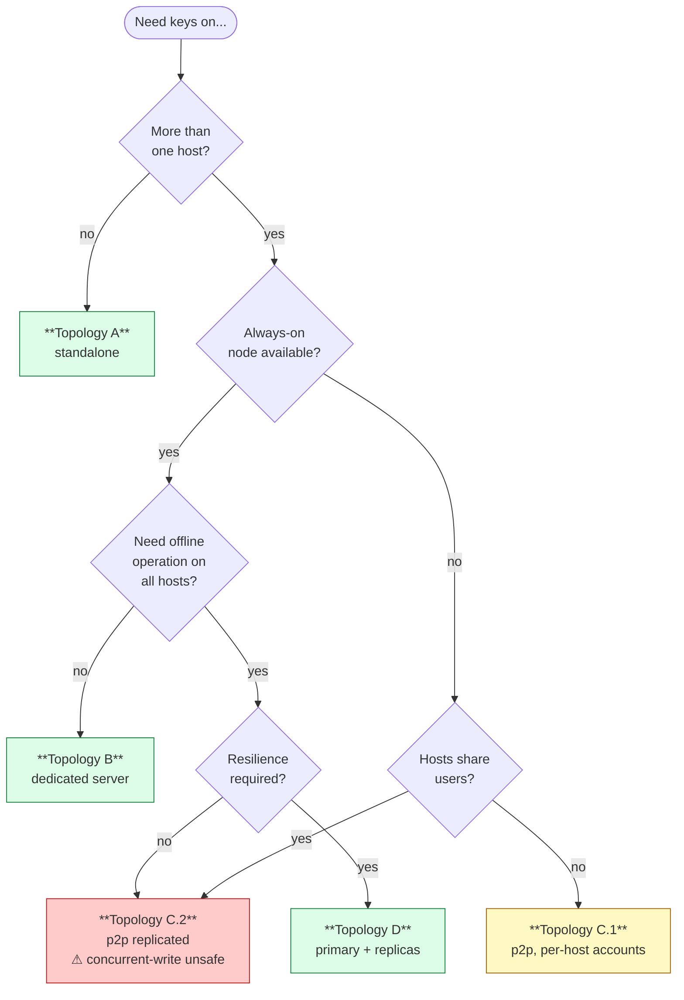
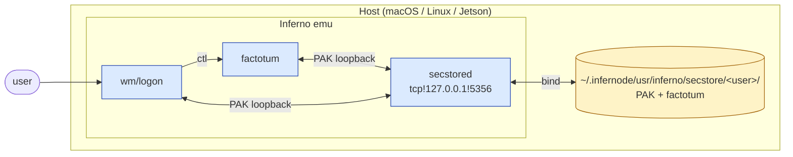
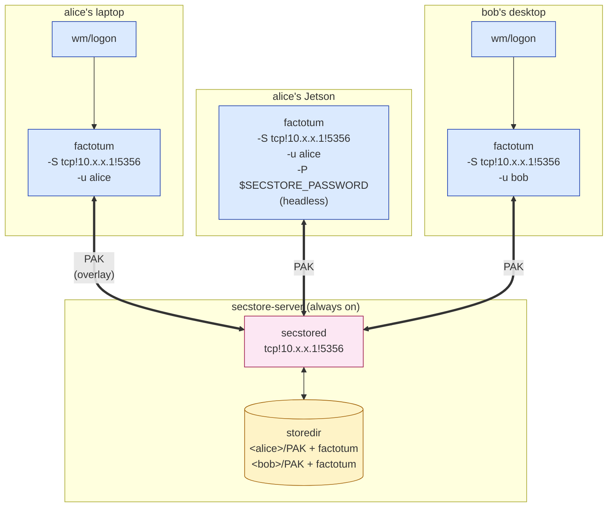
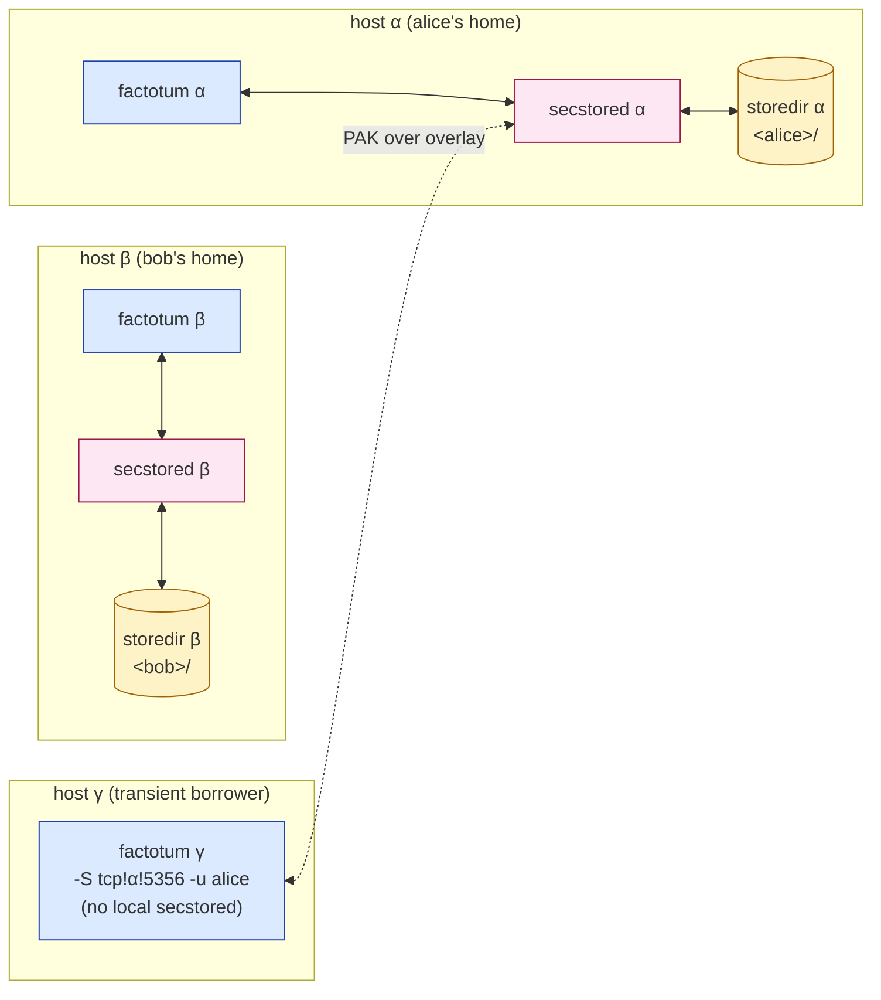
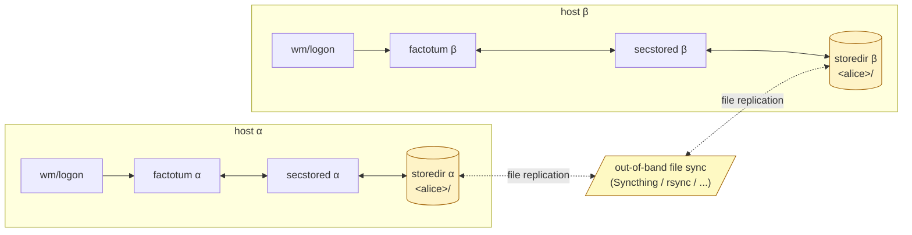
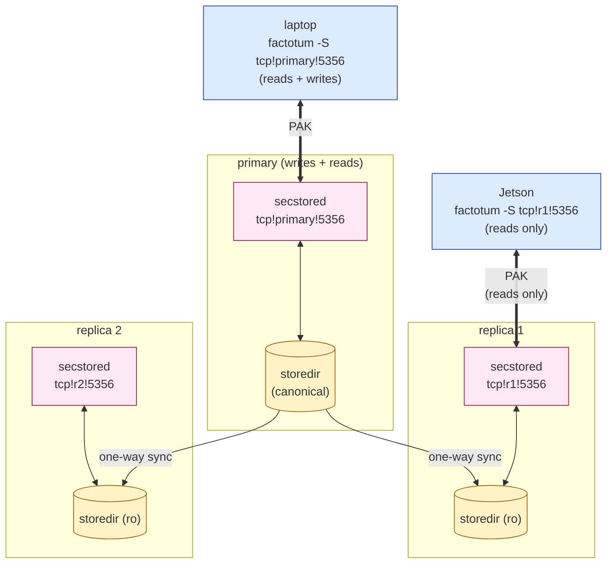
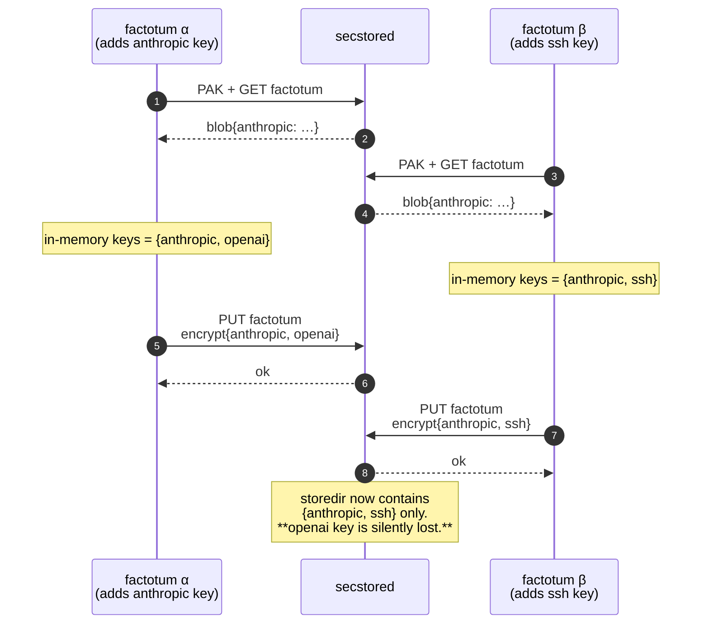
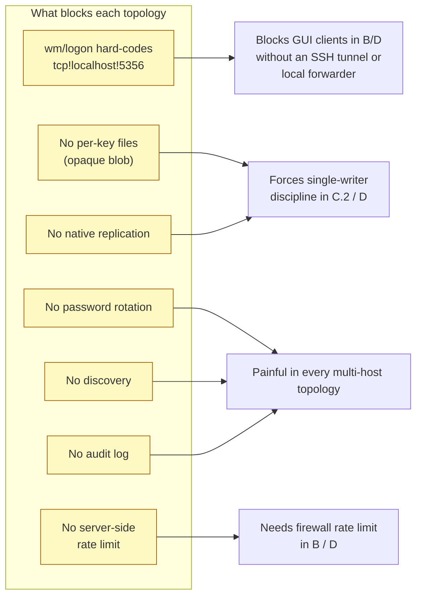

# Distributed Authentication

> **Scope.** Deployment topologies for the secstore + factotum stack across
> more than one host. Read [AUTHENTICATION.md](AUTHENTICATION.md) first — this
> document assumes you understand PAK, the on-disk format, and the boot
> sequence.
>
> **Prerequisite.** "Distributed" here means *multiple Inferno instances
> sharing keys*, on a private overlay network. Secstore was not designed to
> face the open internet; every topology below assumes ZeroTier, WireGuard,
> Tailscale, a VPN, or a physically isolated LAN.
>
> **Historical note.** Classic secstore clients default to
> `net!$auth!secstore`, with `$auth` resolved by Inferno's normal connection
> server / name database (`cs` / `ndb`) to the site's authentication host.
> "Auth network" in old documentation usually means that trusted, site-local
> network context, not a separate cryptographic subsystem.

## 1. Choosing a topology



A single InferNode runs the full auth stack — secstored, factotum, wm/logon —
in one Inferno emu, sharing one storedir. That's the right answer for
laptops, single-user desktops, and the macOS `.app` bundle.

Beyond a single host, the question is *where the system of record lives*. The
secstore on-disk state is the source of truth: lose it, the keys are gone.
Whoever holds the storedir is, effectively, in custody of every cryptographic
secret the user has saved. The topologies below differ mainly in *where that
storedir physically lives* and *how many instances of secstored serve it*.

## 2. Topology A — Standalone host (single emu)

The default. Documented here for completeness.



- secstored, factotum, and the GUI all live in one emu.
- The storedir is on the host filesystem (`~/.infernode/...`) bound into Inferno
  via trfs so it survives emu restarts.
- The TCP loopback hop is real but cheap; conceptually, it's all one process
  group.
- Threats are exactly those listed in [AUTHENTICATION.md §8](AUTHENTICATION.md#8-threat-model--full):
  read-only disk attacker (offline brute force) and total host compromise.

**When to use.** Default for everything. If only one machine ever needs the
keys, do not move beyond this topology — every other shape adds attack
surface.

## 3. Topology B — Dedicated secstore server

Multiple Inferno hosts; one of them (or a hardened box that does nothing
else) runs the only secstored. Other hosts run factotum with `-S` pointed at
that server. The storedir lives only on the server.



- The server is a single point of *availability* but *not* of trust beyond
  what it already had (it never sees plaintext keys). Factotum still encrypts
  blobs client-side before PUT.
- Each client host runs its own factotum; keys live in factotum's process
  memory only on the host that needs them.
- No client trusts another client. The server enforces per-user directory
  isolation. Two clients of *different* users on the same network see only
  their own blob.
- Two clients of the *same* user (e.g. alice's laptop and her Jetson) share
  the blob. Last-writer-wins. There is no merge, no CRDT, no record-level
  locking. See §6 for what this means in practice.

### 3.1 Setup sequence

```mermaid
sequenceDiagram
    actor admin as operator
    participant srv as server emu
    participant store as storedir
    participant client as client emu
    participant F as client factotum

    Note over admin,store: One-time server setup<br/>remote serving is explicit because InferNode defaults secstored to loopback
    admin->>srv: auth/secstored -a tcp!*!5356
    admin->>srv: auth/secstore-setup -u alice
    srv->>store: write &lt;alice&gt;/PAK
    admin->>srv: auth/secstore-setup -u bob
    srv->>store: write &lt;bob&gt;/PAK

    Note over admin,F: Per-client setup
    admin->>client: auth/factotum -S tcp!10.x.x.1!5356<br/>-u alice -P $SECSTORE_PASSWORD
    client->>F: spawn
    F->>srv: PAK + GET factotum
    alt new account, no factotum file
        srv-->>F: -1 (not found)
        Note over F: starts empty,<br/>persists on first save
    else
        srv-->>F: encrypted blob
        F->>F: decrypt2 → load keys
    end
```

For interactive (GUI) clients, see §8 — `wm/logon` currently hard-codes
`tcp!localhost!5356`, so a GUI client of a remote server needs a workaround.

### 3.2 Threats specific to this topology

- **Reachability of the server is a liveness dependency.** A network
  partition means clients cannot save new keys; existing in-memory keys
  continue to work until the host restarts.
- **An attacker on the overlay can probe `cansecstore`** to enumerate users.
  Treat user names as semi-public.
- **Online password guessing** is bounded by the per-attempt modexp (~5 s)
  and network RTT. There is no built-in lockout. A determined attacker with
  persistent overlay access *can* try a few attempts per minute. Use
  high-entropy passwords; consider `iptables`/firewall-level rate limiting
  on port 5356.
- **A storedir compromise on the server compromises every user.** Encrypt
  the underlying disk; restrict shell access; back up to immutable storage
  so that ransomware can't simultaneously corrupt and exfiltrate.

This topology is intentionally explicit in InferNode. The original secstore
client API includes `cansecstore()` account probes, and InferNode keeps that
wire compatibility. What InferNode changes is the deployment default:
single-host boot uses loopback, and an operator must opt into remote exposure
with `-a tcp!*!5356` or another non-loopback address.

## 4. Topology C — Peer-to-peer

Every Inferno host runs its own secstored *and* its own factotum, each with
its own storedir. The hosts may serve different users (per-host accounts) or
the same user (replicated accounts). There is no central authority.

### 4.1 Per-host accounts (no replication)

α holds alice's account; β holds bob's. They never share storedirs. This is
just two Topology-A deployments on the same overlay, with no
crypto-protocol-level interaction between them.



Keys cross between hosts only through ad-hoc means: a transient client
borrowing keys from another host's secstore (γ in the diagram), or a user
typing a password on β to make β's factotum hold the same key alice has on α.
This is the model assumed by the legacy
"`auth/factotum -S tcp!mac-ip!5356 -u username -P password`" recipe in older
docs — same shape as Topology B, just with the "server" happening to be
another user's workstation.

### 4.2 Replicated accounts ⚠

α and β both hold alice's storedir, kept in sync out-of-band (e.g. Syncthing,
rsync over WireGuard, an `ssh` cron job). alice can log in on either host;
factotum on each host points at its local secstored.



Properties:

- **Offline-friendly.** Either host can authenticate without the other.
- **Concurrent writes are unsafe.** See §6 below.
- **Replication trust.** Whoever runs the sync sees the encrypted blobs and
  the PAK verifier. They learn nothing useful (same threat profile as a
  read-only disk attacker, §8 of AUTHENTICATION.md), but they are now another
  copy that can be lost or stolen. Encrypt the transport.
- **Password rotation is hard.** Both replicas must be rotated before either
  is used again, or the older one will overwrite the newer with a blob
  encrypted under the old password.

This sub-topology is operationally fragile and we do not recommend it without
a coordinator. If you need cross-host replication, prefer Topology D.

## 5. Topology D — Hybrid (primary + read replicas)

A central authoritative secstored serves writes; one or more replica
secstoreds serve reads. The replicas are kept in sync from the primary by
copying the storedir (read-only on the replica side) — typically via
Syncthing in send-only mode, or `rsync --delete` over an authenticated
overlay link.



**Caveat.** secstored as shipped does not distinguish reads from writes at the
protocol level — `PUT` works on any reachable instance. Replicas only stay
read-only because the *underlying filesystem* is mounted read-only or because
the sync overwrites client writes shortly afterwards. Treat replicas as
strictly read-only at the operator level: point save-back factotums at the
primary only.

This topology is appropriate when:

- The primary has bounded availability (e.g. a home server) and you want
  Jetson nodes to keep authenticating during brief primary outages by
  reading from a replica.
- You want geographic redundancy without the concurrent-write problems of
  pure replication (§4.2). The primary is the single source of truth.

## 6. Concurrency and the opaque blob

Every topology that allows two factotums to write back to the same storedir
inherits one root problem: **the `factotum` file is one opaque AES-GCM blob
keyed by the user's password.** secstored cannot merge two saves; it can
only accept the latest `PUT` and overwrite.

The race is easy to demonstrate:



The semantics across topologies:

| Setting                                | Behaviour                              |
|----------------------------------------|----------------------------------------|
| Same host, two emus                    | Racy. Last writer wins.                |
| Two hosts, one storedir, no sync       | Racy across reconnects.                |
| Two hosts, one storedir, with sync (C.2) | Racy across the sync window.         |
| One primary, N replicas (D)            | Serialised by the primary. Safe.       |

If you need multiple writers, the only safe pattern is *all writes through a
single secstored*. Reads can fan out; writes cannot. This is the operational
discipline of Topology B and the entire reason Topology D exists.

A future direction is per-key files (one secstore object per `key …` line)
so that two clients adding different keys can both succeed. That is not
implemented today; do not assume it.

## 7. Deployment matrix

|                                  | A (standalone) | B (dedicated server) | C.1 (P2P, no replication) | C.2 (P2P, replicated) | D (primary + replicas) |
|----------------------------------|----------------|----------------------|--------------------------|----------------------|------------------------|
| Hosts that hold the storedir     | 1              | 1                    | N (one per account)      | N (replicated)       | N (1 primary, N read)  |
| Single point of failure          | host           | server               | host of each user        | none                 | primary                |
| Concurrent-write safe            | yes (1 writer) | yes                  | yes (1 writer/user)      | **no**               | yes (writes → primary) |
| Offline operation                | yes            | no (needs server)    | yes                      | yes                  | yes (writes blocked)   |
| Cross-host key sharing           | no             | yes (server-mediated)| no                       | yes (sync-mediated)  | yes (server-mediated)  |
| New attack surface vs A          | —              | TCP 5356 on overlay  | TCP 5356 on each host    | sync transport       | TCP 5356 + sync        |
| Operational complexity           | low            | medium               | medium                   | high                 | high                   |
| Recommended for                  | laptops, default | small teams; Jetson fleet | air-gapped peers     | avoid                | resilience-critical    |

## 8. Known limitations and roadmap

These are real today. Each one bounds what topologies can be deployed
without out-of-band glue.



1. **`wm/logon` hard-codes `tcp!localhost!5356`** (`appl/wm/logon.b:533`).
   Topology B with an *interactive* GUI client requires either patching the
   address or running a local secstored that forwards to the remote one.
   Headless `factotum -S` already accepts any address.
2. **No per-key files.** All keys live in one blob; concurrent writes lose
   data. (§6)
3. **No password rotation tooling.** Documented manual procedure only;
   automation is on the road map. (AUTHENTICATION.md §9)
4. **No server-side rate limiting.** Online guessing is bounded only by
   modexp + RTT. Mitigate at the firewall.
5. **No replication protocol.** Topology C.2 and D rely on out-of-band
   filesystem sync. There is no native log-shipping or write-ahead replay.
6. **No native discovery.** Clients must be configured with the server's
   address. ZeroTier-managed DNS or static `/lib/ndb/local` entries are
   the canonical workarounds.
7. **No secstore audit log.** secstored logs to stderr (which goes to the
   emu console) but does not persist authentication attempts to disk.
   Capture `stderr` if you want a record.
8. **Same `(p, q, r, g)` across deployments.** The PAK parameters are
   compiled in. This is fine cryptographically (they were chosen by Vita
   Nuova and have stood for two decades) but it does mean every InferNode
   instance shares the same group, so cross-protocol attacks are a
   theoretical concern if the parameters are ever found weak.

## 9. Recommended starting point

Most users should run **Topology A**. A pair of hosts that both belong to
one user (e.g. laptop + Jetson) is best served by **Topology B** with the
server on whichever host is most often online. Multi-user fleets converge on
**Topology B** unless availability requires **Topology D**. Topology C
exists for completeness and edge cases; do not adopt it as a default.

## 10. Pointers

- [AUTHENTICATION.md](AUTHENTICATION.md) — protocol, file format, threat model.
- [ARCHITECTURE.md](ARCHITECTURE.md) — system architecture overview.
- [WALLET-AND-PAYMENTS.md](WALLET-AND-PAYMENTS.md) — wallet keys live in
  factotum and inherit secstore's security properties.
- `appl/cmd/auth/secstored.b` — the server's `-a` flag controls the bind
  address.
- `appl/cmd/auth/factotum/factotum.b` — the `-S` flag (and the `secstore`
  ctl verb) control where save-back goes.
- `appl/cmd/auth/secstore-setup.b` — the canonical way to create a remote
  account (no GUI required).
